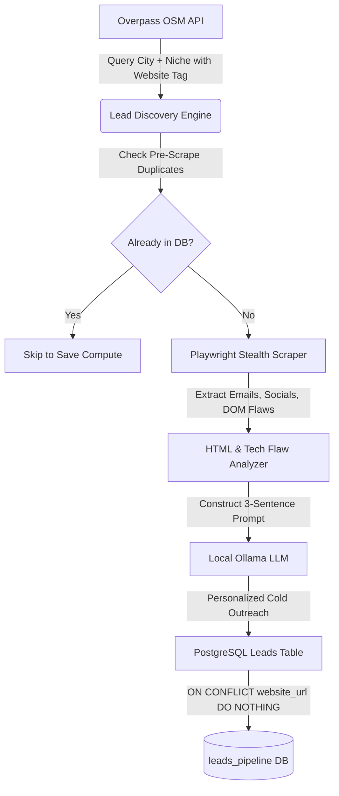

# Autonomous Lead Discovery, Extraction & AI Outreach Pipeline

A modular, asynchronous Python data extraction pipeline designed to discover local and international businesses (e.g., dental clinics in Texas), extract verified contact details using stealth browser automation, generate personalized 3-sentence technical flaw cold outreach messages via a local Ollama LLM, and store deduplicated records in PostgreSQL.

---

## 🏗 System Architecture



---

## 🚀 Features

- **Lead Discovery (`discovery.py`)**: Queries OpenStreetMap via Overpass API for specific city and niche with strict `['website']` tag filters and multi-mirror automatic failover.
- **Stealth Scraper (`extractor.py`)**: Uses Playwright with `playwright-stealth`, headless evasion flags, user-agent spoofing, and contact extraction (`mailto:`, email regex, `instagram.com`, `linkedin.com`, plus contact page traversal). Identifies technical flaws such as missing viewport meta tags, missing meta descriptions, missing OpenGraph tags, slow load times, or insecure protocols.
- **AI Drafting Engine (`ai_drafter.py`)**: Asynchronously calls local Ollama (`llama3.2:1b` or any loaded model) to draft a strict 3-sentence personalized cold outreach pitch highlighting the exact technical flaw detected.
- **PostgreSQL Persistence & Deduplication (`database.py` & `schema.sql`)**: Manages asyncpg connection pool, auto-initializes the schema, and enforces a `UNIQUE` constraint on `website_url` using `INSERT INTO ... ON CONFLICT (website_url) DO NOTHING`.

---

## 📦 Requirements

- Python 3.10+
- PostgreSQL 14+
- Ollama (running locally on port 11434 with a model such as `llama3.2:1b`)

Install dependencies:
```bash
pip install -r requirements.txt
playwright install chromium
```

---

## ⚙️ Configuration (`.env`)

```env
# PostgreSQL Configuration
DB_HOST=127.0.0.1
DB_PORT=5432
DB_NAME=leads_pipeline
DB_USER=postgres
DB_PASSWORD=1234

# Ollama LLM Configuration
OLLAMA_BASE_URL=http://127.0.0.1:11434
OLLAMA_MODEL=llama3.2:1b

# Scraper Settings
PLAYWRIGHT_HEADLESS=true
PAGE_TIMEOUT_MS=30000
```

---

## 🛠 Usage

### 1. Run Verification Test
Tests PostgreSQL schema initialization, Ollama 3-sentence draft generation, Playwright stealth scraper, and deduplication logic:
```bash
python test_pipeline.py
```

### 2. Run Pipeline for Any City and Niche
```bash
python pipeline.py --city "Austin" --niche "dentist" --limit 5
```

### 3. Test a Specific Target URL
```bash
python pipeline.py --test-url "https://example.com"
```
# Sisu
