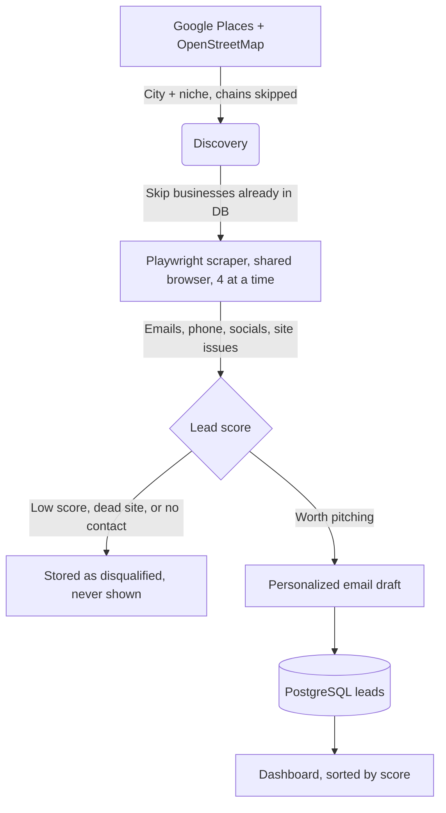

# Sisu: Local Business Lead Pipeline

Finds local businesses (dentists, plumbers, salons...) in a rotation of cities, checks their websites for problems you can fix, drops the ones that don't need you, and drafts a personalized cold email for the rest. Leads land in PostgreSQL and are worked from a Next.js dashboard.

---

## 🏗 How it works



### Discovery (`discovery.py`)
- **Google Places (New) Text Search** when `GOOGLE_PLACES_API_KEY` is set: best coverage, plus phone, rating and review count. Places without a website become `no_website` leads reachable by phone.
- **OpenStreetMap (Overpass)** always, as a free fallback, with mirror failover.
- Chains/franchises (OSM `brand` tag) are skipped. Known businesses are excluded *before* the per-run limit, so each run reaches further into a city instead of returning the same first results.
- Deduplication is on a **dedupe key**: the bare domain for websites (`http://www.x.com/austin` = `x.com`), the profile path for social links, or the Google place id.

### Scraping and scoring (`extractor.py`)
Each site is loaded in a shared Chromium (waiting for JS-rendered content), then checked for:

| Issue | Weight | Pitch |
|---|---|---|
| No mobile viewport | 35 | redesign |
| Plain `http://` (no SSL) | 30 | redesign |
| Copyright footer 3+ years old | 25 | redesign |
| No way to book online | 20 | booking automation |
| Contact form but no booking | 15 | booking automation |
| Slow load (>5s) | 10 | |
| Missing meta description / thin text / no OpenGraph | 5 / 5 / 2 | |

Sites scoring under `MIN_LEAD_SCORE` (20), for example a modern site that already uses Calendly, ServiceTitan or similar, are **disqualified**. So are sites that fail to load and businesses with no email, phone or social profile. Disqualified businesses are stored with `status = 'disqualified'` so they are never rescraped.

Emails are pulled from `mailto:` links, page text and Cloudflare-protected addresses, filtered for placeholder/asset junk, and **checked for MX records** so dead domains don't bounce.

### Email drafts (`ai_drafter.py`)
Each email opens with the single strongest thing found on that site, something the owner can check in ten seconds ("Chrome shows a *Not secure* warning on yoursite.com", "the footer still says © 2017"). It then says why that costs them customers and makes one low-effort offer (free mockup, a 2-minute video). Every draft has a subject line and an opt-out line, plus your postal address if `SENDER_ADDRESS` is set (required for US commercial email).

Drafts are template-based by default. Set `USE_LLM_DRAFTS=true` to have Ollama reword them; output that drifts (placeholders, writing as the business, too long) is discarded in favour of the template.

---

## 📦 Requirements

- Python 3.10+
- PostgreSQL 14+
- Optional: a Google Cloud API key with **Places API (New)** enabled (billed per request)
- Optional: Ollama, only if `USE_LLM_DRAFTS=true`

```bash
pip install -r requirements.txt
playwright install chromium
cp .env.example .env   # then fill in DB_PASSWORD, SENDER_ADDRESS, GOOGLE_PLACES_API_KEY
```

---

## 🛠 Usage

```bash
# Daily run: continues the city x niche rotation until 15 new leads are saved
python pipeline.py

# Start from a specific city / niche, or change the quota
python pipeline.py --city "Austin" --niche "dentist" --quota 25

# Scrape and score a single site
python pipeline.py --test-url "https://example.com"

# Rotation controls
python pipeline.py --force-next     # skip to the next city/niche
python pipeline.py --reset-state    # start the rotation over
```

### Tests

```bash
pytest                    # offline unit tests (scoring, email cleaning, discovery, drafts)
python test_pipeline.py   # end-to-end smoke test; needs PostgreSQL and internet
```

### Dashboard

```bash
cd dashboard && npm install && npm run dev
```

The dashboard has no login. Run it locally only.

---

## ⚖️ Sending responsibly

- Send from a separate, warmed-up domain, a few dozen emails a day at first.
- US (CAN-SPAM): include your postal address and honour opt-outs.
- Canada (CASL) and Australia (Spam Act) require consent. Business addresses published on the company's own site generally count as implied consent only when your message relates to their business role. Check before emailing those markets.
